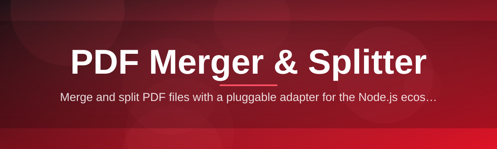
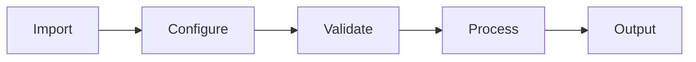

# pdf-merger-splitter-suite 📄✂️

  

*One suite. Every page. Merge, split, and rebuild PDFs without ever leaving Windows.*

  

## 🔎 Overview

<strong>Full story — click to expand</strong>

 

PDFs are the load-bearing wall of modern paperwork — contracts, invoices, scanned archives, reports stitched together from a dozen sources. Yet the tooling around them has stayed stubbornly fragmented: one app to merge, another to split, a browser tab for the rest, and your documents scattered across all three. **pdf-merger-splitter-suite** exists to collapse that fragmentation into a single, dependable desktop utility.

This is a native Windows application built for people who touch PDFs daily — paralegals assembling exhibits, finance teams consolidating statements, students combining lecture notes, developers packaging documentation. It treats PDF merging and PDF splitting as first-class, mirror-image operations: combine many files into one, or carve one file into many, with the same predictable engine underneath.

We built it because "quick online PDF tool" too often means uploading sensitive documents to an unknown server and hoping for the best. This suite runs entirely on your machine. No uploads, no accounts, no waiting on a spinner while your contract sits on someone else's infrastructure. Just a fast, local, professional-grade PDF merger and splitter.

  

---

## 🧩 What It Actually Does

1. **Drag-and-merge assembly** — drop any number of PDFs into a visual tray and reorder them by drag, not by guesswork.
2. **Precision splitting** — cut a document by page range, page count, bookmark, or exact byte size, down to a single page.
3. **Live thumbnail preview** — see every page as a rendered tile before you commit to a merge or split.
4. **Batch pipelines** — queue dozens of merge or split jobs and let the engine chew through them unattended.
5. **Page-level surgery** — delete, rotate, or reorder individual pages inside a document without exporting to another tool.
6. **Metadata-safe processing** — bookmarks, form fields, and document properties survive merges and splits intact.
7. **Password-aware handling** — open, process, and re-secure encrypted PDFs without stripping protection you rely on.
8. **Zero-cloud architecture** — every byte stays on local disk; the app never phones home with your document contents.

> [!NOTE]
> The suite is optimized for large batches. Merging 200+ files or splitting a 1,000-page document is a supported, tested workflow — not an edge case that chokes the engine.

---

## 🚀 Getting Started

1. Open the landing page via the **GET STARTED** button above.
2. Download the Windows package — no account, no email gate.
3. Run the executable. There is no installer wizard to click through.
4. Drop your PDFs into the window and choose **Merge** or **Split**.

> [!TIP]
> Pin the app to your taskbar after first launch — most users return to it daily once it replaces their browser-based PDF workflow.

---

## 🖥️ System Requirements

| Component | Minimum |
|---|---|
| OS | Windows 10 (64-bit) or Windows 11 |
| RAM | 4 GB (8 GB recommended for large batch jobs) |
| Disk | 200 MB free space |
| Dependencies | None — fully standalone, no runtime to install |
| Internet | Not required after download |

> [!IMPORTANT]
> This is a Windows-native build. There is no macOS or Linux binary distributed from this landing page — running it under emulation layers is unsupported.

---

## ⚙️ How It Works

1. **Ingest** — files are loaded and parsed locally; page count, size, and structure are indexed in memory.
2. **Plan** — you define the operation: merge order, split boundaries, or page-level edits.
3. **Validate** — the engine checks for corruption, encryption, and structural conflicts before touching the output.
4. **Render** — pages are recomposed page-by-page, preserving fonts, images, and vector content.
5. **Deliver** — a clean output file (or set of files) is written to your chosen folder.

---

## 🛟 Troubleshooting

**Q: My merged PDF is missing bookmarks from the source files.**
A: Enable "Preserve navigation" in the merge dialog — it's on by default but can be toggled off accidentally in batch mode.

**Q: Splitting by page count leaves one oddly small file at the end.**
A: That's expected — if your page total isn't evenly divisible, the final chunk absorbs the remainder rather than padding blank pages.

**Q: The app says a PDF is "structurally invalid."**
A: The source file has a broken cross-reference table, often from a bad scan-to-PDF export. Try re-saving it through a print-to-PDF pass first.

**Q: Password-protected PDFs won't load.**
A: Enter the owner password in the unlock prompt before merging or splitting — user-only passwords without permission flags may still restrict page extraction.

**Q: Output file size is larger than the sum of inputs.**
A: Font subsets and embedded resources sometimes get duplicated during merge; use "Optimize output" in Settings to deduplicate shared assets.

**Q: Batch queue stalls on one file.**
A: Corrupt or incomplete downloads are the usual culprit — remove that file, re-acquire it, and re-queue.

---

## 🎨 Interface & Experience

- Keyboard shortcuts:

  1. `Ctrl+O` — open files
  2. `Ctrl+M` — start merge
  3. `Ctrl+Shift+S` — start split
  4. `Delete` — remove selected page/file
  5. `Ctrl+Z` — undo last page edit

- Themes: Light, Dark, and System-matched (auto-switches with Windows theme).
- Settings persist per user profile — no reconfiguration between sessions.
- Drag-to-reorder is animated for clarity when merging many files.

  

---

## 🤝 Contributing & Community

> We welcome issue reports, feature requests, and discussion threads. Before opening an issue, search existing threads — many merge/split edge cases are already documented.

1. Fork the repository and branch from `main`.
2. Keep changes focused — one feature or fix per pull request.
3. Describe reproduction steps clearly for any bug fix.
4. Be respectful; this project runs on volunteer maintainer time.

> [!WARNING]
> Pull requests that bundle unrelated formatting changes with functional code will be asked to split before review — fitting, given the project's namesake.

---

## 📜 License

Released under the [MIT License](LICENSE), 2026.

---

## ⚖️ Disclaimer

This software is provided "as is," without warranty of any kind. Always keep backups of original documents before running batch merge or split operations. The maintainers are not liable for data loss, corrupted output, or misuse of processed PDF files.

  

